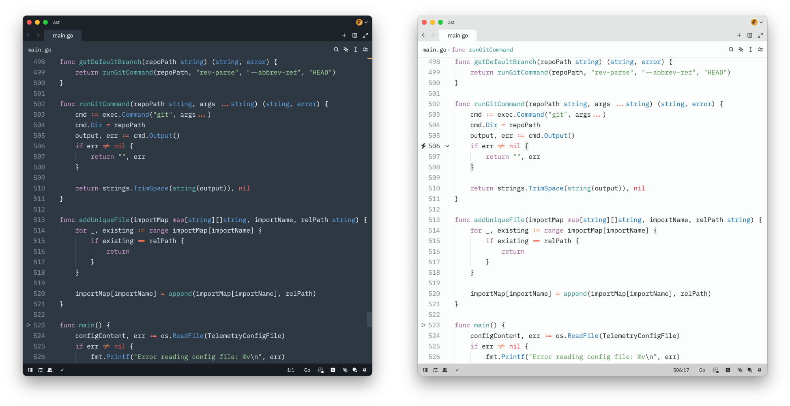

# Sublime Mariana Theme for Zed Editor

Brings Sublime Text 4's Mariana theme to [Zed Editor](https://zed.dev/).

Uses cool, muted colours that reduce eye strain. Skips cursive and italic fonts entirely—just clean, readable text.

## Installation and usage

First, install Sublime Mariana via extenstion's manager:

1. `Go` → `Command Palette...` (`⌘⇧P`) → **zed:extensions** (or use hotkeys `⌘⇧X`)
2. Select `Sublime Mariana Theme` and press `Install`.

To enable:

1. `Go` → `Command Palette...` (`⌘⇧P`) → **theme selector:toggle** (or use hotkeys `⌘K ⌘T`)
2. Select `Sublime Mariana` (dark) or `Sublime Breakers` (light)

## Variations

The theme comes in two versions: _Mariana_ and _Mariana Breakers_. They tick close to the original Sublime Text version. Mariana Breakers adds more contrast keeping the same colour palette.

## Inspiration

[bIaqat/mariana-theme-zed](https://github.com/bIaqat/mariana-theme-zed/)

## License

Made by a human being, not LLM.

Copyright © 2024 Roman Hnatiuk

Licensed under MIT.
